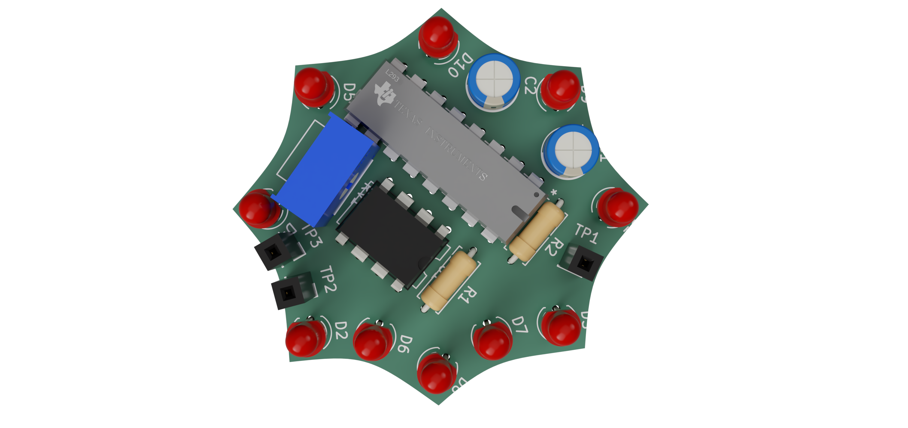
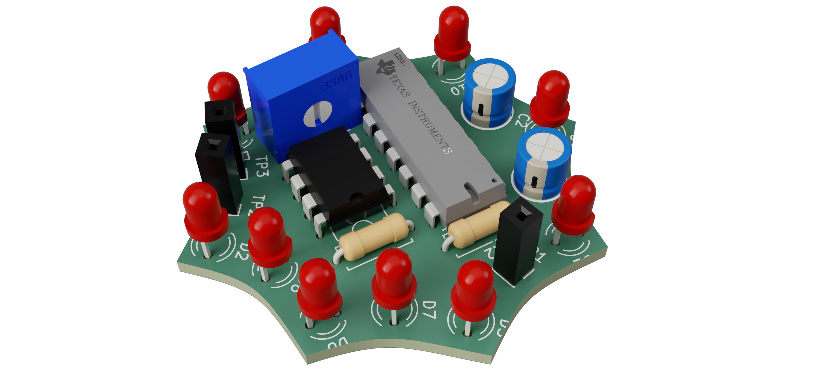
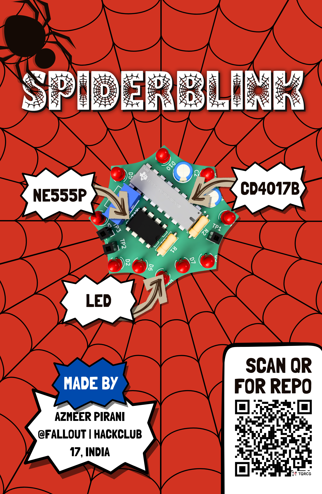
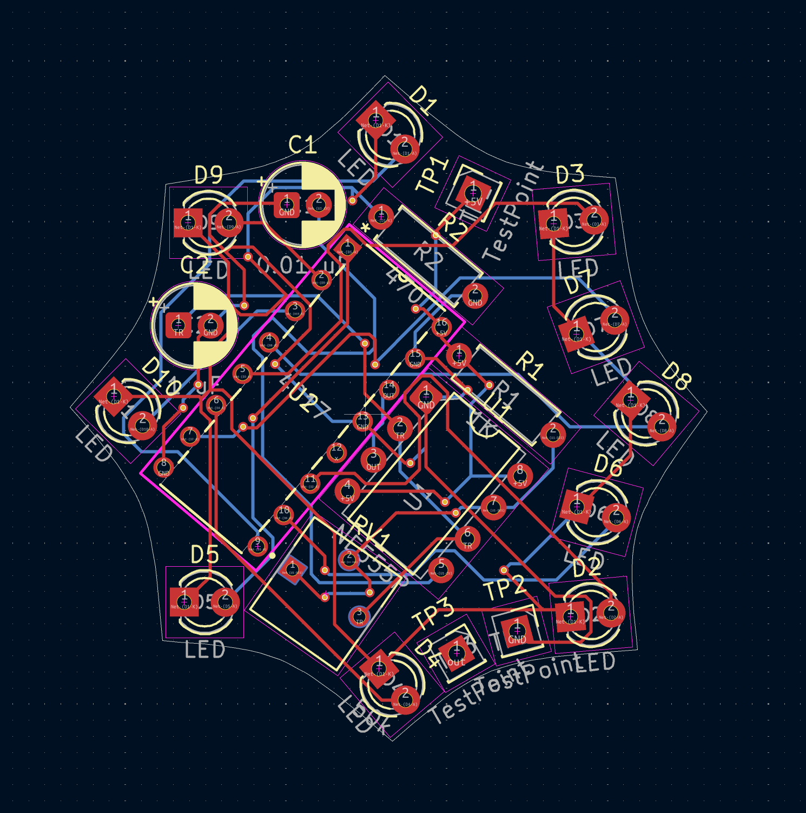
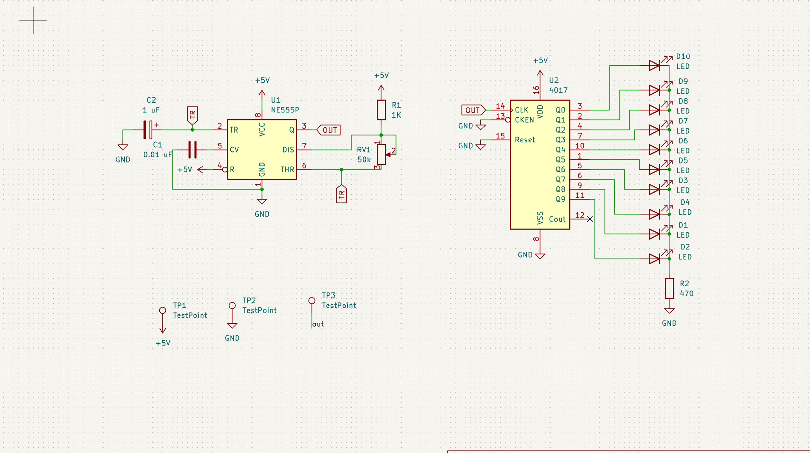

<div align="center">

# 

A Tiny LED Blinker in Shape of a Spiderweb

<p>


</p>

### _Blinks every time it gets the tingle._


  
  
  
  
</p>
</div>


# Overview

**SpiderBlink** is a 555 LED chaser board that blinks 10 LEDs in a variable speed sequence using a **NE555P** timer IC and a **CD4017** decade counter. I built this as a beginner PCB project to learn schematic design, PCB routing, and hands-on soldering.

---

# Gallery

<div align="center">



</div>

---

# Zine

<div align="center">



</div>

---

# Motivation

I wanted to dvelve deeper into embedded electronics, so thought this might be the chance for me to understand more about ICs, Timers and Oscillators

---


## Bill of Materials

|Reference|Description                     |Manufacturer     |MPN               |Quantity|Supplier         |Unit Price (USD)|Extended Price (USD)|Product Link                                                                     |
|---------|--------------------------------|-----------------|------------------|--------|-----------------|----------------|--------------------|---------------------------------------------------------------------------------|
|C1       |0.01 µF Ceramic Capacitor       |Murata           |GRM188R71H103KA01D|1       |Murata           |0.10            |0.10                |https://www.murata.com/en-global/products/productdetail?partno=GRM188R71H103KA01D|
|C2       |1 µF Ceramic Capacitor          |Murata           |GRM188R60J105KA01D|1       |Murata           |0.15            |0.15                |https://www.murata.com/en-global/products/productdetail?partno=GRM188R60J105KA01D|
|D1-D10   |5 mm Red LED                    |Kingbright       |WP7113ID          |10      |Kingbright       |0.18            |1.80                |https://www.kingbrightusa.com/product.asp?catalog_name=LED&product_id=WP7113ID   |
|R1       |1 kΩ 1/4W Through-Hole Resistor |Yageo            |CFR-25JB-52-1K    |1       |Yageo            |0.02            |0.02                |https://www.yageo.com/en/Product/Search?partNumber=CFR-25JB-52-1K                |
|R2       |470 Ω 1/4W Through-Hole Resistor|Yageo            |CFR-25JB-52-470R  |1       |Yageo            |0.02            |0.02                |https://www.yageo.com/en/Product/Search?partNumber=CFR-25JB-52-470R              |
|RV1      |50 kΩ Trimmer Potentiometer     |Bourns           |3362P-1-503LF     |1       |Bourns           |1.25            |1.25                |https://www.bourns.com/products/trimpot-trimming-potentiometers/product/3362     |
|U1       |NE555P Timer IC                 |Texas Instruments|NE555P            |1       |Texas Instruments|0.60            |0.60                |https://www.ti.com/product/NE555                                                 |
|U2       |CD4017B Decade Counter          |Texas Instruments|CD4017B           |1       |Texas Instruments|0.75            |0.75                |https://www.ti.com/product/CD4017B                                               |

---

# Features

- Heartbeat: An NE555 timer generates the clock signal.
- Speed Control: A 50kΩ potentiometer adjusts the LED flashing speed.
- Sequencer: A CD4017 decade counter cycles the signal through 10 steps.
- Rotating Effect: 10 LEDs arranged in a circular pattern for a rotating effect.

---

# PCB Design

The PCB was designed with the reference of a piderweb, more specifically Spiderman

## PCB


## Schematic


---

# Current Status

- [X] Initial Concept
- [X] Schematic Design
- [X] PCB Design
- [X] Hardware Validation
- [ ] Functional Testing
- [ ] Community Evaluation 

---

# Repository Structure

```bash
SpiderBlink/
├── PCB/
├── BOM.csv
├── Gallery/
└── README.md
```

---

# Assemble Guide

## 1. Order the PCB

Navigate to:

```bash
./PCB/Gerber.zip
```

Upload the Gerber files to your preferred PCB manufacturer.

---

## 2. Order Components

All required components can be found in:

```bash
./PCB/BOM.csv
```

---

## 3. Solder the Components

Recommended assembly should follow a low-profile to high-profile sequence to simplify alignment and reduce rework.

Suggested order:

1. 1/4W Resistors (R1, R2)
2. Ceramic Capacitors (C1, C2)
3. NE555P
4. 5mm LEDs (D1–D10)

---

## 4. Inspect the Board

Before powering:
- Check for shorts
- Verify connections
- Inspect power rails

---

# Contributing

Contributions, suggestions, and feedback are welcome.

If you'd like to improve SpiderBlink:

```bash
git clone https://github.com/Sudo-Aju/SpiderBlink.git
cd SpiderBlink
```

1. Create a feature branch
2. Make your changes
3. Commit your work
4. Open a pull request

---

# Creator

### Azmeer Pirani

Built with ❤️ for:
- Embedded Systems
- PCB Design
- Open Source Hardware
- Tiny Things

---

# License

This project is licensed under the MIT License.

---

<div align="center">

## SPIDERBLINK

### _Blinks every time it gets the tingle._

</div>
